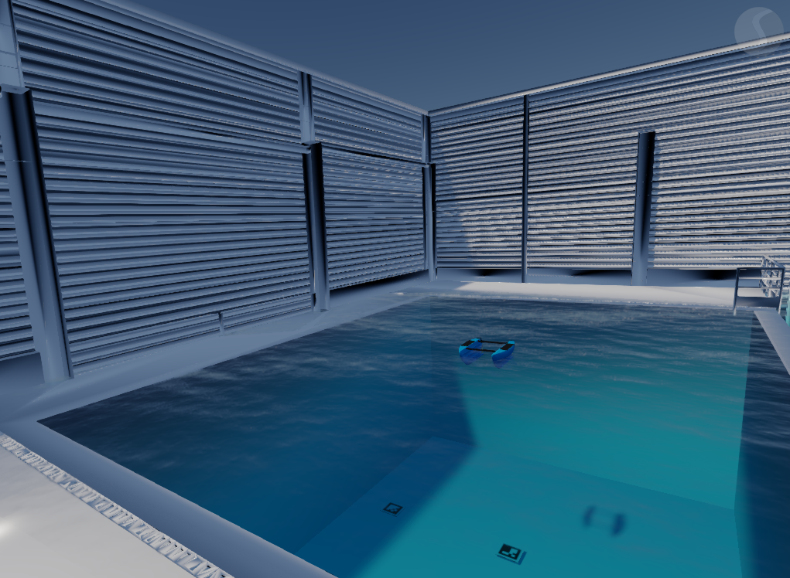

# blueboat_stonefish — CIRTESU BlueBoat Stonefish Simulation (ROS 2)

<!-- Optional hero image -->

<p align="center">
  
</p>

This repository contains a specialized **Stonefish** simulation suite developed at **CIRTESU (Castellón, Spain)**.
It provides assets, scenarios, and ROS 2 launch/configuration to simulate the **BlueBoat** USV in detailed environments replicating CIRTESU facilities.

## Overview

* **High-fidelity maritime simulation** using Stonefish.
* **CIRTESU scenarios** with multiple environment models, including a fully detailed **complete** CIRTESU model prepared for LiDAR-based SLAM and navigation experiments.
* **BlueBoat integration**: robot model, sensors, and ROS 2 interfaces ready to use.
* Integration designed for **LiDAR-inertial SLAM, localization, and navigation** with FAST-LIO-based pipelines.

## Stonefish / FAST-LIO integration

This repository is built around the CIRTESU simulation stack used to run the BlueBoat with **LiDAR-inertial SLAM and navigation inside Stonefish**.

Instead of the upstream official repositories, this project depends on the following CIRTESU forks:

* **Stonefish (core simulator, modified)**
  [https://github.com/Mariolopez31/stonefish](https://github.com/Mariolopez31/stonefish)
* **stonefish_ros2 (ROS 2 interface matching the modified Stonefish version)**
  [https://github.com/Mariolopez31/stonefish_ros2](https://github.com/Mariolopez31/stonefish_ros2)

These forks include the **LiDAR / Livox support** required by the BlueBoat simulation and by the FAST-LIO-based workflow used in this project.
The detailed CIRTESU environment is provided specifically to support **mapping, localization, and navigation experiments** in a realistic facility-scale scenario.

## Prerequisites

Validated environment for this repository:

* **Ubuntu 22.04**
* **ROS 2 Humble**
* A recent GPU with **OpenGL 4.3** support and correctly installed vendor drivers
* Standard ROS 2 build tools:

  * `colcon`
  * `rosdep`
  * `git`
  * `cmake`
  * `build-essential`
  * `pkg-config`

Main runtime / build dependencies used by this stack:

* **Stonefish** (modified CIRTESU fork)
* **stonefish_ros2** (matching CIRTESU fork)
* `xacro`
* `robot_state_publisher`
* `tf2_ros`
* `tf-transformations`
* `cv_bridge`
* `image_transport`
* `camera_info_manager`
* `vision_opencv`
* `pcl_ros`
* `navigation2`
* `nav2_bringup`
* `robot_localization`

For the full FAST-LIO workflow, the workspace also requires the external localization packages used by the project:

* **FAST_LIO**
  `https://github.com/hku-mars/FAST_LIO.git`
* **FAST-LIO localizer / global localization package**
  `<https://github.com/liangheming/FASTLIO2_ROS2.git>`

In the CIRTESU devcontainer, the validated environment also includes additional dependencies commonly used across the stack, such as **Eigen**, **Sophus**, **GCC 13**, **OpenCV**, **MAVROS**, **GeographicLib datasets**, joystick tools, and **Micro-XRCE-DDS-Gen**.

## Installation

```bash
mkdir -p ~/your_ws/src
cd ~/your_ws/src

# Core simulation stack used by this project
git clone https://github.com/Mariolopez31/stonefish.git
git clone https://github.com/Mariolopez31/stonefish_ros2.git

# This package
git clone https://github.com/Mariolopez31/blueboat_stonefish.git

# Optional / required when using the FAST-LIO launch files
git clone <https://github.com/hku-mars/FAST_LIO.git>
git clone <https://github.com/liangheming/FASTLIO2_ROS2.git>>
```

First, install the modified **Stonefish core** by following the build instructions provided in the `stonefish` repository itself.
Then build `stonefish_ros2` and the rest of the workspace **against that same Stonefish version**.

```bash
cd ~/your_ws
rosdep update
rosdep install --from-paths src --ignore-src -r -y

colcon build --symlink-install
source install/setup.bash
```

If you are using the CIRTESU devcontainer, most system dependencies are already preinstalled.

## Launch modes

This repository provides two main simulation workflows.

### 1. Simulation-only mode (without FAST-LIO)

Reference launch: `launch/blueboat_cirtesu.launch.py`

This mode starts the Stonefish simulation, loads the BlueBoat model, and exposes the simulator topics needed for visualization, debugging, and downstream integration, but does **not** run FAST-LIO.

In this setup, the simulator odometry is bridged to TF using `odom2tf`, so the main transform up to the robot body is published manually:

```text
world_ned
└── blueboat/base_link
    ├── blueboat/lidar_front
    ├── blueboat/camera_link
    ├── gps_frame
    └── ...
```

### 2. FAST-LIO mode (mapping + localization)

Reference launch: `launch/blueboat_cirteus.launch.py`

This mode starts the simulation together with the FAST-LIO-based stack used in CIRTESU:

* **FAST_LIO** provides high-rate local LiDAR-inertial odometry and fast map generation.
* The **localizer** provides lower-rate global correction / relocalization against a prebuilt map. Note that you will need to create your reference **\<map\>.pcd** before use it.

In this setup, the TF tree is conceptually split into:

```text
map
└── odom
    └── body / blueboat/base_link
        ├── LiDAR frame
        ├── camera_link
        ├── gps_frame
        └── ...
```

Where:

* `map -> odom` is the global correction produced by the localizer
* `odom -> body` is the high-rate local pose estimated by FAST-LIO
* `blueboat/base_link_enu -> blueboat/base_link --> sensors` is provided by the robot URDF through `robot_state_publisher`

Depending on the exact FAST-LIO packages and frame naming used in your workspace, `body` may coincide with `blueboat/base_link` directly or be bridged to it through a fixed transform.

## Repository contents

Typical components you will find in this repo:

* **Scenarios / worlds** replicating CIRTESU facilities (multiple variants / detail levels)
* **Meshes / textures** for CIRTESU environments and visualization assets
* **BlueBoat robot description** published through `/robot_description` using **xacro**
* **Sensor setup** for simulation and FAST-LIO workflows
* **Launch files** for simulation-only and FAST-LIO-based execution
* **RViz configuration** for quick inspection of the robot, TF tree, point clouds, images, and markers
* Utility nodes such as **`odom2tf`**

## RViz

A ready-to-use RViz configuration is included to visualize the BlueBoat model, TF tree, LiDAR point cloud, camera image, and markers.

For pure simulation, a typical fixed frame is `world_ned`.
When running the FAST-LIO + localizer pipeline, `map` (or the chosen global frame) is usually the more convenient fixed frame.

## Odometry and TF bridge (`odom2tf`)

Stonefish publishes simulator odometry as a `nav_msgs/Odometry` topic (for example, `/blueboat/navigator/odometry`).

When running **without** FAST-LIO, this repository uses `odom2tf` to publish the transform from `world_ned` to `blueboat/base_link`, making the robot available in the TF tree for RViz and other ROS tools.

When running **with** FAST-LIO, the localization stack is responsible for the main pose-related TF chain, so `odom2tf` is primarily relevant to the simulation-only workflow.
